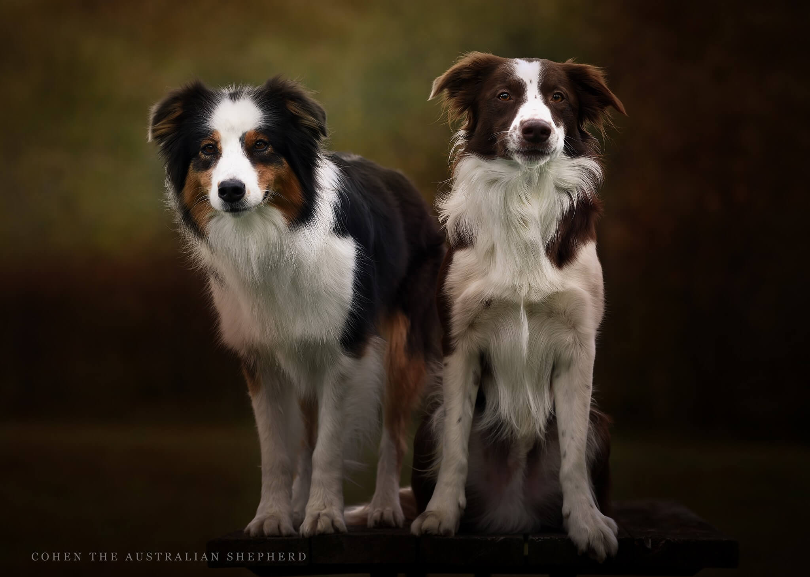
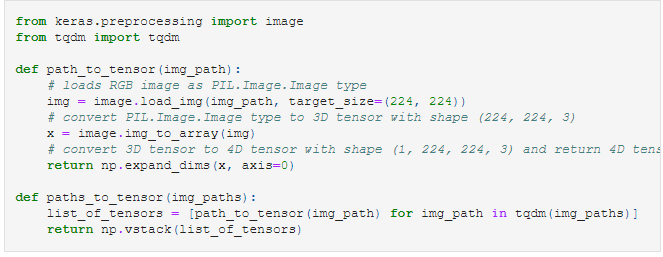
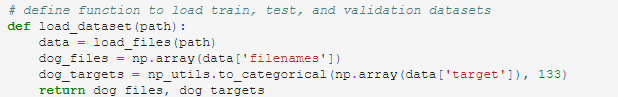
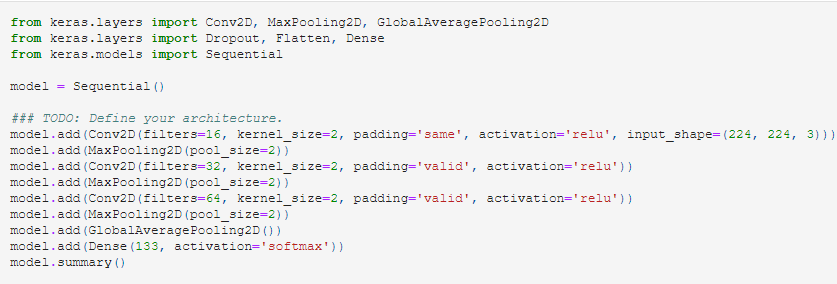
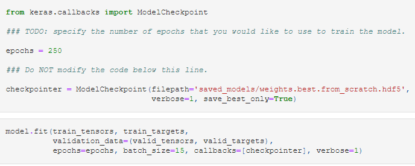
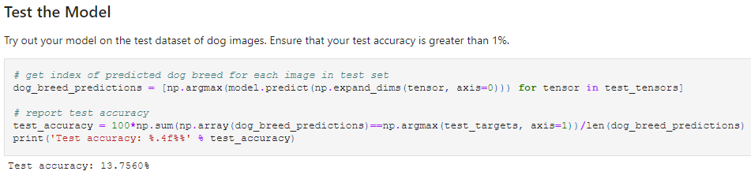
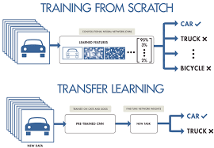
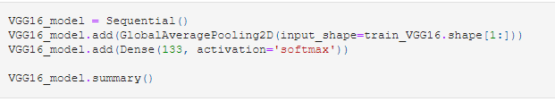

# Dog-Breed-Classifier: Convolutional Neural Nets and Transfer Learning for image classification
Pipeline to process real-world user-provided images to Convolutional Neural Network that classifies image as Dog Breed

> Convolutional Neural Network (CNN) is a special grade of Neural Network that can view and generalize patterns from raw images. It is able to then make use of the different patterns to generalize even more complex patterns. Here the CNN will be used to classify an image into one of the particular breeds.


## Task at Hand: Keras-based dog breed classifier
<b>Intro</b>
Making a classifier for Dogs breeds, let alone Humans, are very difficult. Dog breeds have very high intercorrelation between the breeds which is makes it difficult to tell breeds apart. That is why this problem is good to learn more about CNNs.



## The dataset
Given 8351 images from Udacity representing 133 dog breeds. Training, validation, and test set are distributed into Train, Testing and Validation sets

## The Bread and Butter: Data preprocessing
Before the image can be passed into the CNN model, we need a function that can convert the image into a tensor. This is because Keras uses Tensorflow. So we convert the images into a 4 dimensional tensor (n_sample, row, col, channel)
- n_sample: number of samples / images in the dataset
- row: row of pixel
- col: col of pixel
- channel: referring to the color channel (3 for RGB and 1 for grayscale)



Models tend to do well with variables between 0 - 1, so it important to normalize the image tensor data to ensure that the values are managable for the model. 


It is also helpful to transform the dog breed labels into categorical data. But since we are given the 133 breeds that we want to classify this is easy



This gives us a One-hot encoded version of the labels as an input vector. For example if all of our breeds were German Shepherd, Dalmatian and Shih Tzu then an output would look like this [1, 0, 0] this means the output was a German Shepherd according to the model.

## Keras-implemented CNN: Modelling in Style
This is very easy due to Keras providing the implementations of the CNN Layers. It should be mentioned that when making the model both the input and output layers are concerned with the input_shape and n_classes.

- input_shape = (244, 244, 3): RGB images resized to 244 x 244
- n_classes = 133: it is the number of dog breeds



After creating the CNN model, it time to train it. Since training can be very time-intensive, it's a good idea to save the model and it's progress as it trains. So using the ModelCheckpoint we can store the weights of the best models as it trains. This allows us to load in the model at a later point without training. This is great because it allows us to re-use our model in other projects as well.




After training we need to see the model's accuracy on the test dataset as a indicator of the model's likely performance on new data. 



### Results: Not looking good
With the current Network in place, the models was able to go above 10% but it is completely unfit for any application at the moment.

## Improve prediction with Transfer learning
So far, we have seen that with the help of Keras, building a Convolutional Neural Network is child's play. But making a Network worth its weight in gold is an entirely different and extremely difficult task. This is a challenge that ML Engineers constantly tackle. So with the help of Transfer Learning we can leverage the model provided by these Engineers and convert for use for the task at hand, instead of struggling to produce an unusable model.



Basically by utilizing an existing network possibly trained for another task to solve our problem. The models we want to use are more complex than our model and can identify many things. So we will basically take the new model as-is and create a new output layer to help the model classify and fit the problem at hand.

Lucky for us, Keras has come to the rescue yet again. It has many of the trained networks made by professional ML Engineers that participate in some of the biggest ML competitions. Below is all we need to do to import one of these computational behemoths



- Since we are leveraging a pre-trianed model, all we have to do is load it
- compute the bottleneck features for training images which is provided by Udacity
- Then we build and train the network as shown above and use the bottleneck features and label of the train set as the input for the model. (We get the labels by having the new model predict them)


The network is made with a small architecture and we repeat the training process. Similar to the custom network, we need to set the input shape


Thus we have successfully leveraged an existing model to speed up training and increase model accuracy

### Results
Using the VGG-19 network with the provided bottleneck features from Udacity, the new model had an accuracy of 66% in 20 epochs. This is staggering when compared to the 13% from our custom model. 

## Summary
Building a specialized neural net to solve dog breed classificaiton was done with relative ease and little data through the use of transfer learning.

- Try to tweak the hyperparameters to increase accuracy and see if 85% - 95% accuracy can be achieved

- Try to move the project to a web app or a mobile device 

# Github Repo Contents

## Table of Contents:
1. [Project Introduction](#project-introduction);
2. [File Description](#file-description)
3. [Libraries Used](#libraries-used)
4. [Results](#results)
5. [Acknowledgements](#acknowledgements)

## Project Introduction
In this project, Images containing Dogs from different breeds are provided. Based on the available image data, the task is to classify the dog present in the image with the proper breed label. The data is provided by the Udacity program.

## File Description
- dog_app.ipynb - notebook contains complete python code starting from library imports to Exploratory Data Analysis, Preparing the Image Data to pass through the models, fitting and evaluating the performance of various models.
- saved_model - folder containing the weights of the best performing models trained in the dog_app.ipynb notebook
- images - provided by Udacity, contains images of dogs and people to be used for the classifier with additional images 
- requirements - provided by Udacity, used to install all packages for the notebook
- haarcascades - provided by Udacity, contains .xml file for the OpenCV face detector in the notebook
- dog_app.html - html version of the dog_app notebook that is good to get a view of the logic
- dog_app.zip - compressed file containing this project

## Libraries Used
The following libraries are used:
- Numpy
- Pandas
- Matplotlib
- Keras
- OpenCV

## Detect Humans
Made function that returns the percentage of human faces found in both the dog and human face datasets respectively, both datasets were of size 100.

## Detect Dogs
Using a pre-trained VGG16 model to find the predicted label for an image:
```dog_detector``` function returns ```True``` if a dog is detected ```False``` otherwise. 

## Classify Dog Breeds with custom CNN
The custom CNN architecture of trained model needed to at least achieve 10% accuracy on the test set. This is where the need for Transfer Learning is evident since the custom implementation required alot of time to achieve a score above 10%.

## Acknowledgements
Thank Udacity for the Nanodegree Couse and for providing the Data for the Image Classifier